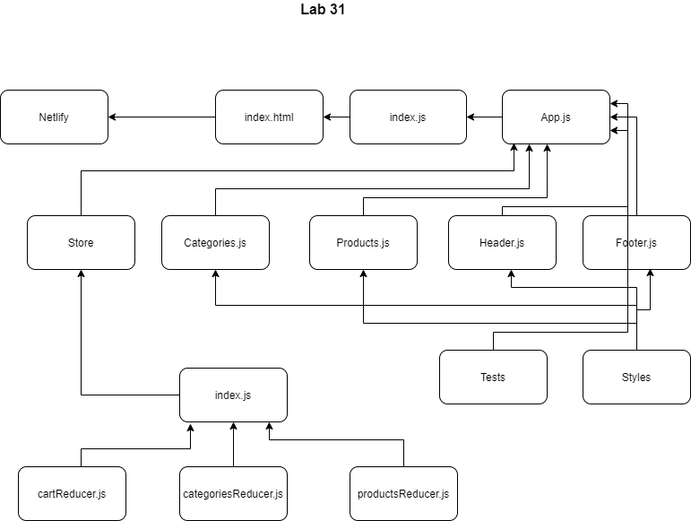

# Application State With Redux

## Application State With Redux

### Author: Shubham Majumdar

### Links and Resources
* [Code Sandbox](https://codesandbox.io/s/github/Shubham-401n16/Hooks-API)
* [Github Actions]
* [PR](https://github.com/Shubham-401n16/Application-State-with-Redux/pull/1)
* [Netlify App](https://priceless-shockley-b74e26.netlify.app)

#### Documentation
* [api docs](http://xyz.com/api-docs) (API servers)
* JSDoc Comment Required for all modules and functions in all .js files

### Setup
#### `.env` requirements (where applicable)
* `PORT` -
* `MONGODB_URI` -

#### How to initialize/run your server app (where applicable)
* `npm start`
* npm install create-react-app
* create-react-app ./
* npm install node-sass
* npm install enzyme-adapter-react-16
* npm install react-router-dom
* npm install react-bootstrap
* npm install bootstrap
* npm install react-redux redux
* npm install @material-ui/core

  
#### Tests
* How do you run tests?
npm test

#### UML

